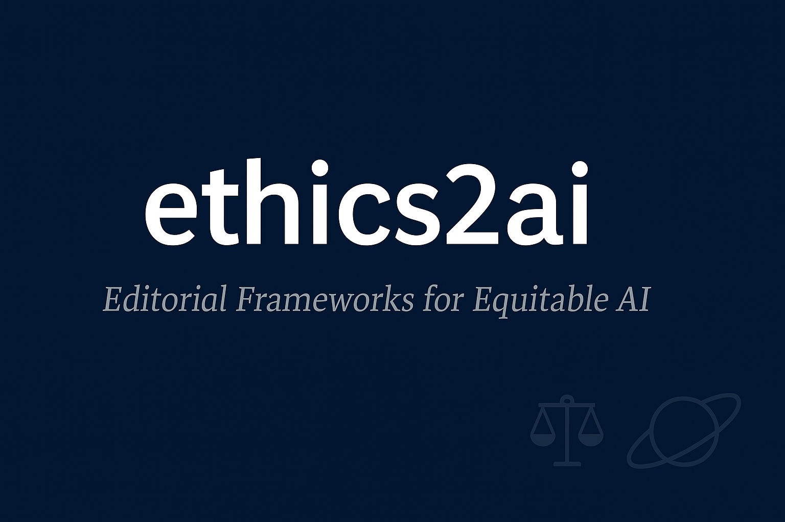

  

# 🧭 ethics2ai: Editorial Frameworks for Equitable AI

---

## 📌 Overview

**ethics2ai** is a living repository dedicated to the editorial, philosophical, and civic scaffolding of artificial intelligence. It is built by Partha Roy—freelance AI ethicist, editorial strategist, and civic scholar—during a critical Saturnian phase of resilience and legacy-building.

This repository offers:
- Ethical frameworks for AI development and annotation
- Editorial templates for scholarly publishing
- Licensing and citation-ready assets (MIT, CC BY)
- Visual and philosophical motifs for inclusive AI outreach

It is both a scholarly archive and a civic declaration: that **AI must grow with equity**, or it risks deepening the very divides it claims to solve.

---

## 📣 Declaration: Growth with Equity in the Age of AI
We are witnessing an unprecedented surge in artificial intelligence—an exhilarating race toward what many call Conscious AI. This will undoubtedly mark a historic milestone in human civilization. Yet, in our craving for technological transcendence, we risk falling into a trap: one where growth without equity deepens disparities, fractures social cohesion, and erodes the very spirit of progress.

**Growth for all is the key to growth of all.**
Without inclusivity, AI becomes a mirror of our inequalities—not a remedy.

The rich and poor, the powerful and the vulnerable, are interdependent. Our systems, economies, and communities thrive only when they are built on shared dignity and ethical care.
Every moment of AI’s evolution demands philosophical reflection and ethical stewardship. Only then can we forge better linkages of life—where automation uplifts rather than excludes, and where technology becomes a servant of justice, not a driver of division.
This repository stands as a call to action:
• 	To embed authorship with accountability, editorial discipline, and ethical clarity into the very fabric of AI development
• 	To ensure that the future we build is not just intelligent—but wise

---

## 🧱 Repository Structure

| Folder/File         | Purpose                                                                 |
|---------------------|-------------------------------------------------------------------------|
| `abstracts/`        | Editorial drafts and philosophical abstracts for journal submission     |
| `frameworks/`       | Ethical models and annotation guidelines for inclusive AI               | 
| `citations/`        | BibTeX, APA, and MLA-ready citation files                               |
| `LICENSE`           | MIT License for open scholarly use                                      |
| `README.md`         | This manifesto and guide                                                 

---

## 🧭 Philosophical Position

This repository is not merely a technical archive—it is a statement of values, a disciplined offering shaped by adversity, reflection, and civic purpose. It stands on the following pillars:
• 	**Dharmic integrity** — A commitment to ethical responsibility, karmic accountability, and principled action in all scholarly and technological endeavors
• 	**Gita-inspired resilience** — Daily anchoring in spiritual clarity, embracing adversity as a catalyst for growth and legacy
• 	**Editorial clarity** — Precision in language, citation, and structure, ensuring that every word serves both scholarship and justice
• 	**Civic empowerment** — Reclaiming technology as a tool for dignity, inclusion, and ethical transformation—not domination or erasure
This work invites collaborators, funders, and readers to engage not just with data, but with conscience. It is a living document—iterative, intentional, and infused with symbolic timing and ritual discipline.

---

## 🛠️ Technical Modesty, Editorial Excellence

While this repository does not offer complex code, it embodies a different kind of rigor—one rooted in reproducibility, ethical clarity, and scholarly precision. It excels in:
• 	**Structuring reproducible scholarly archives** — Ensuring transparency, accessibility, and long-term academic value
• 	**Licensing and metadata integration** — Supporting open use, proper attribution, and platform interoperability
• 	**Visual storytelling for funders and collaborators** — Communicating purpose and impact through design and clarity
• 	**Editorial refinement for journal-ready manuscripts** — Honoring language, citation, and philosophical depth

---
## 🪐 Philosophical Discipline and Karmic Authorship

This repository is built under a regime of philosophical austerity—a time of editorial rigor and civic reflection. Every file, every phrase, is a ritual of resilience. As its author, I do not merely document AI’s rise—I bear witness to its ethical crossroads. I offer this work as both a scholarly archive and a civic invocation: that we must not build intelligence without wisdom, nor automation without compassion.

---

## 🤝 Collaborate or Support

If you are:
- A funder seeking ethical clarity in AI
- A researcher needing editorial scaffolding
- A civic technologist building inclusive frameworks
- A publisher or journal editor seeking reproducible ethics

You are warmly invited to **collaborate**, **cite**, or **support** this work. It is offered as both a scholarly archive and a civic invocation—where editorial precision meets ethical purpose.

📧 Contact: r.partha7@gmail.com  
🔗 ORCID: https://orcid.org/0009-0002-1893-3637  

---

## 🕉️ Closing Affirmation

> “Let your work be rooted in dharma, not desire. Let your legacy be built on equity, not ego.”  
> — Inspired by the **Bhagavad Gita, Chapter 2**
> This repository is not just a scholarly offering—it is a karmic gesture, a civic invocation, and a disciplined stand for ethical clarity in AI. May it serve those who seek wisdom over speed, compassion over control, and legacy over noise.

---

